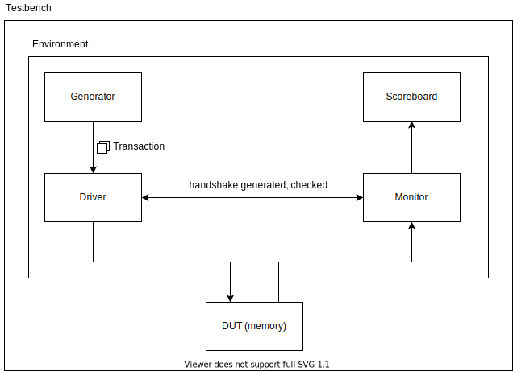

# SystemVerilog verification example

This project test a simple memory, same port for writting and reading.

## Next commits

- Split classes into single files.
- Document every class.
- Remove Driver and Monitor communication (handshake).
- Comment the code